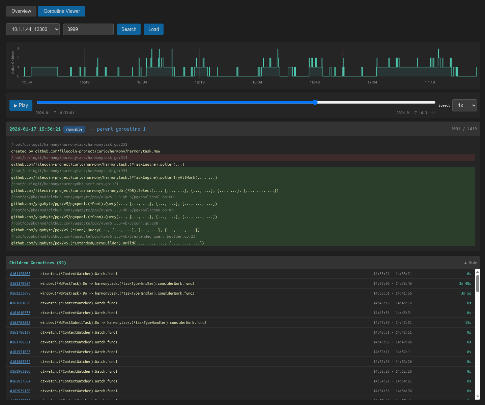

# gscrape

A toolkit for scraping, indexing, and analyzing Go pprof goroutine dumps over time. Useful for debugging goroutine leaks, understanding concurrency patterns, and tracking goroutine lifecycles in long-running Go applications.



## Features

- **Periodic scraping** of `/debug/pprof/goroutine?debug=2` endpoints
- **Indexed storage** using Pebble DB for fast querying of goroutine history
- **Web UI** with:
  - Overview chart showing active goroutines over time per host
  - Goroutine timeline viewer with stack trace diff highlighting
  - Parent/child goroutine relationship tracking
  - Children goroutines list with activity chart

## Installation

```bash
go install github.com/magik6k/gscrape/cmd/gscrape@latest
go install github.com/magik6k/gscrape/cmd/gindex@latest
go install github.com/magik6k/gscrape/cmd/gweb@latest
```

Or build from source:

```bash
git clone https://github.com/magik6k/gscrape
cd gscrape
go build ./cmd/gscrape
go build ./cmd/gindex
go build ./cmd/gweb
```

## Usage

### 1. Scrape goroutine dumps

Periodically fetch goroutine dumps from your Go application's pprof endpoint:

```bash
./gscrape -targets "host1:6060,host2:6060" -interval 30s -output ./output
```

Options:
- `-targets` - Comma-separated list of host:port targets exposing pprof
- `-interval` - Scrape interval (default: 30s)
- `-output` - Output directory for dumps (default: ./output)

Dumps are saved as gzip-compressed files in `output/<host>/<timestamp>.goroutines.txt.gz`.

### 2. Build the index

Index the scraped data for fast querying:

```bash
./gindex -cmd index -input ./output -db ./gindex.db
```

Options:
- `-cmd` - Command: `index` to build index
- `-input` - Input directory with scraped dumps
- `-db` - Path to Pebble database (default: ./gindex.db)

The indexer:
- Parses all goroutine dumps and builds time series for each goroutine
- Tracks parent-child relationships between goroutines
- Pre-computes statistics for fast chart rendering
- Compresses data with gzip for efficient storage

### 3. Launch the web UI

```bash
./gweb -db ./gindex.db -addr :8080
```

Then open http://localhost:8080 in your browser.

Options:
- `-db` - Path to Pebble database
- `-addr` - Listen address (default: :8080)

## Web UI Guide

### Overview Tab

Shows a line chart of active goroutines over time for all hosts. Useful for spotting goroutine leaks or unusual spikes.

### Goroutine Viewer Tab

1. Select a host from the dropdown
2. Enter a goroutine ID or search by partial ID
3. Click "Load" to view the goroutine's timeline

Features:
- **Timeline slider** - Scrub through the goroutine's lifetime
- **Playback controls** - Play/pause with adjustable speed
- **Stack trace diff** - Changed lines highlighted in red, new lines in green
- **Reversed stack** - Root function at top for stable display during playback
- **Parent link** - Click to navigate to the parent goroutine
- **Children chart** - Shows number of active child goroutines over time
- **Children list** - Expandable list of spawned goroutines with their entry points

Keyboard shortcuts:
- `Left/Right arrows` - Step through frames
- `Space` - Toggle playback

## Additional Tools

### gcount

Convert debug=2 format dumps to debug=1 grouped format:

```bash
./gcount < dump.txt
```

## Data Format

The indexer stores data in Pebble with these key prefixes:
- `g:<host>:<goroutineID>` - Goroutine time series (gzip JSON)
- `c:<host>:<parentID>` - Children list for a goroutine (gzip JSON)
- `s:<host>` - Pre-computed stats for charts (gzip JSON)
- `m:hosts` - List of all hosts (JSON)
- `f:<funcName>` - Function occurrence index (gzip JSON)

## Requirements

- Go 1.21+
- Target applications must expose pprof endpoints (`net/http/pprof`)

## License

MIT License - see [LICENSE](LICENSE) for details.
